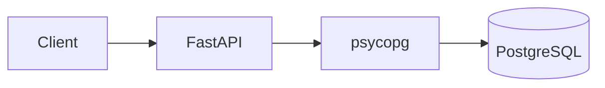

# fastapi-postgres-demo

FastAPI と PostgreSQL を使った、シンプルな業務向けデモアプリケーションです。

## Overview

このリポジトリでは、Python の FastAPI から PostgreSQL に接続し、データベースを操作する基本的な構成を確認します。

できるだけ構成を単純にし、以下の基本的な流れを理解・説明できることを目的としています。



## Technologies

* Python
* FastAPI
* psycopg
* PostgreSQL

## Features

現在は、以下の機能を実装しています。

* PostgreSQL への接続
* `users` テーブルの作成
* ユーザーの登録
* ユーザー一覧の取得
* FastAPI の Swagger UI による API 確認

## Project Structure

```text
fastapi-postgres-demo/
├── app/
│   └── main.py
├── .gitignore
├── requirements.txt
└── README.md
```

## Setup

### 1. PostgreSQL の起動

macOS では Homebrew を利用して PostgreSQL をインストールできます。

```bash
brew install postgresql
brew services start postgresql
```

### 2. Database の作成

```bash
createdb demo_db
```

### 3. Python 仮想環境の作成

```bash
python3 -m venv .venv
source .venv/bin/activate
```

### 4. Python パッケージのインストール

```bash
pip install -r requirements.txt
```

## Run

以下のコマンドで FastAPI を起動します。

```bash
uvicorn app.main:app --reload
```

起動後、以下にアクセスしてください。

* API: http://127.0.0.1:8000
* Swagger UI: http://127.0.0.1:8000/docs

アプリケーションの起動時に `users` テーブルが作成されます。

## API

### GET `/`

動作確認用のエンドポイントです。

```json
{
  "message": "Hello FastAPI + PostgreSQL!"
}
```

### POST `/users`

ユーザーを登録します。

### GET `/users`

登録済みのユーザー一覧を取得します。

## Database

現在は以下のような `users` テーブルを使用しています。

```text
users
├── id
├── name
└── email
```

## Purpose

このリポジトリは、本格的なWebアプリケーションの実装を目的としたものではありません。

FastAPI と PostgreSQL を使って、

**「API からデータベースへ接続し、データを保存・取得する」**

という基本的な構成を、できるだけ小さなコードで確認・説明することを目的としています。

## Future Improvements

今後、必要に応じて以下のような機能を追加する予定です。

* 環境変数による DB 接続情報の管理
* Repository / Service 層の導入
* 複数テーブルおよびリレーションの追加
* テストの追加
* Docker による環境構築
* データベースマイグレーションの導入
