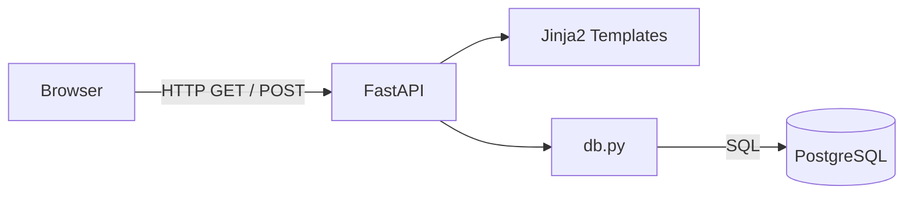
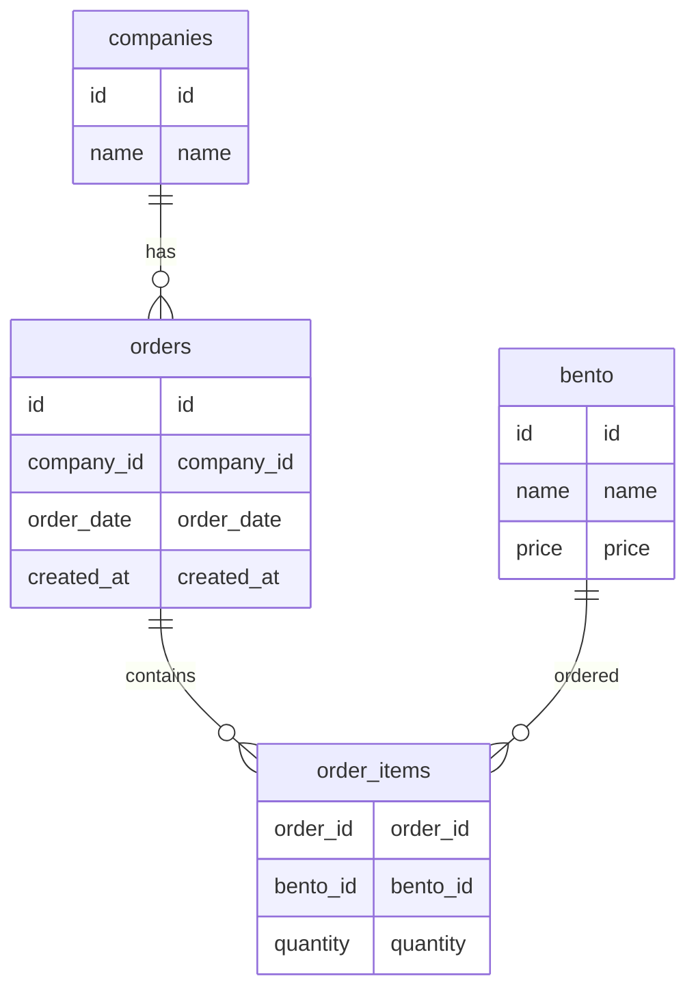
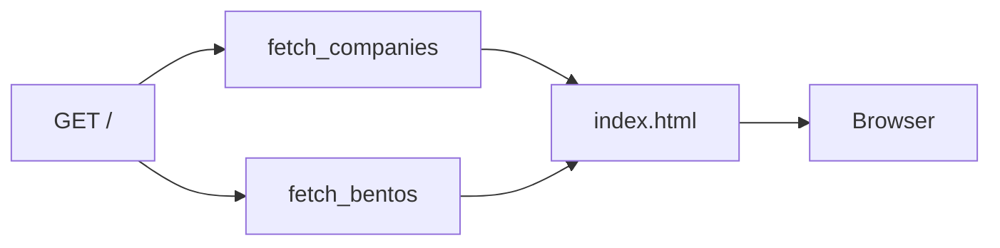
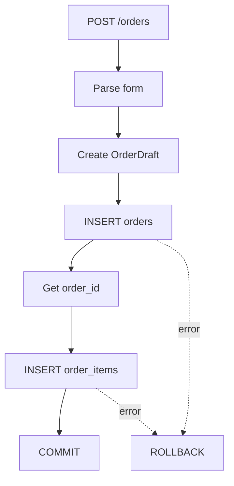
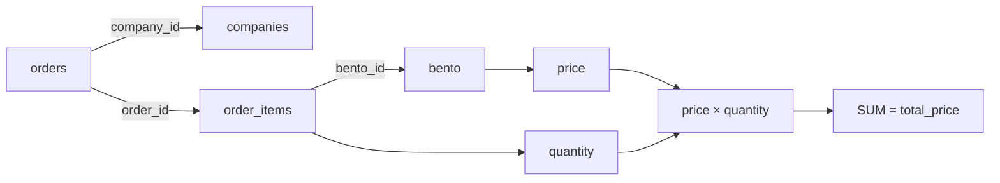
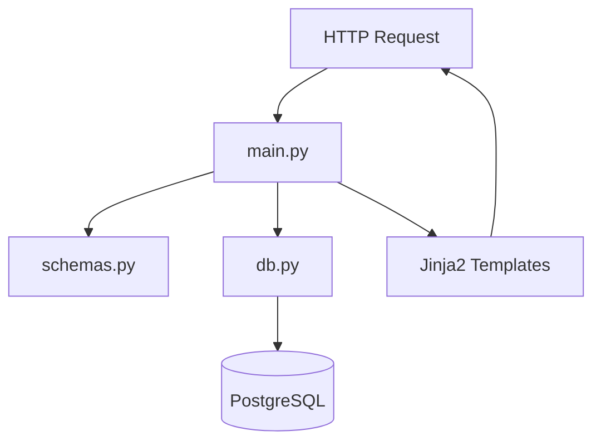
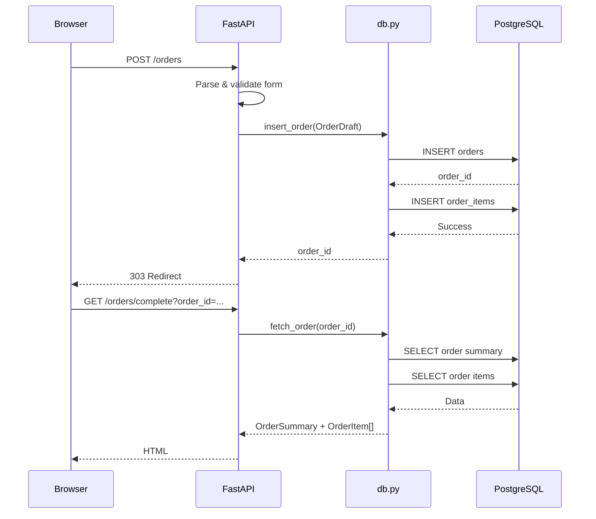

# FastAPI PostgreSQL Demo

弁当の仕出し注文を題材にした、業務用デモアプリです。

**FastAPI + PostgreSQL + Jinja2** というシンプルな構成で、RDBにおける会社・注文・注文明細・弁当の関係と、Web画面からの注文登録・履歴参照・注文詳細表示を確認することを目的とします。

現在の実装は、FastAPIのWeb層、PostgreSQLへのSQLアクセス、Pydanticによる不変なデータモデルに分離されています。

---

## 1. システム構成



使用技術：

- Python
- FastAPI
- Uvicorn
- psycopg
- PostgreSQL
- Pydantic
- Jinja2 / HTML

フロントエンドはサーバーサイドレンダリングのHTMLを使用します。
ReactやVueなどのフロントエンドフレームワークは使用していません。

---

## 2. ディレクトリ構成

現在のPythonコードから確認できる構成は次のとおりです。

```text
fastapi-postgres-demo/
├── app/
│   ├── main.py
│   ├── db.py
│   ├── schemas.py
│   └── templates/
│       ├── index.html
│       ├── order_history.html
│       └── order_complete.html
└── ...
```

`main.py` は `app/templates` をJinja2のテンプレートディレクトリとして使用しています。

---

## 3. データモデル

アプリケーション内部では、Pydanticモデルを使用してデータを表現しています。

すべてのモデルで `frozen=True` を指定しており、アプリケーションデータを不変な値として扱う設計です。

### Company

会社を表します。

| Field | Type | Constraint |
| --- | --- | --- |
| `id` | `int` | - |
| `name` | `str` | - |

### Bento

弁当マスタを表します。

| Field | Type | Constraint |
| --- | --- | --- |
| `id` | `int` | - |
| `name` | `str` | - |
| `price` | `int` | `>= 0` |

### OrderSummary

注文履歴・注文概要を表します。

| Field | Type | Constraint |
| --- | --- | --- |
| `id` | `int` | - |
| `order_date` | `str` | - |
| `company_name` | `str` | - |
| `total_price` | `int` | `>= 0` |

### OrderItem

注文に含まれる弁当1種類分の明細を表します。

| Field | Type | Constraint |
| --- | --- | --- |
| `name` | `str` | - |
| `quantity` | `int` | `> 0` |
| `price` | `int` | `>= 0` |
| `subtotal` | `int` | `>= 0` |

### QuantitySelection

注文登録時に選択された弁当と数量を表します。

| Field | Type | Constraint |
| --- | --- | --- |
| `bento_id` | `int` | `> 0` |
| `quantity` | `int` | `> 0` |

`as_db_tuple` プロパティによって、

```text
(bento_id, quantity)
```

というDB登録用のタプルに変換できます。

### OrderDraft

注文登録時の入力データをまとめます。

| Field | Type | Constraint |
| --- | --- | --- |
| `company_id` | `int` | `> 0` |
| `order_date` | `str` | - |
| `quantities` | `tuple[QuantitySelection, ...]` | 1件以上 |

---

## 4. PostgreSQLとの対応

`db.py` のSQLから、現在のアプリケーションが利用しているテーブルは次の4つです。



コードから確認できる関係は、

- `orders.company_id` → `companies.id`
- `order_items.order_id` → `orders.id`
- `order_items.bento_id` → `bento.id`

です。

なお、以前のREADMEに記載されていた `allergens` / `bento_allergens` については、**現在のPythonコードからは利用されていることを確認できません**。そのため、このREADMEでは現在のアプリケーション構成には含めていません。

また、実際のPostgreSQL側の型・制約・インデックス・外部キー定義については、SQLのDDLが提示されていないため、このREADMEでは断定していません。

---

## 5. DBアクセス

`db.py` はPostgreSQLへのアクセスと、DB上のデータをPydanticモデルへ変換する処理を担当します。

### 接続

接続URLは環境変数 `DATABASE_URL` から取得します。

設定されていない場合は、

```text
dbname=demo_db
```

がデフォルト値として使用されます。

```python
DATABASE_URL = os.getenv("DATABASE_URL", "dbname=demo_db")
```

### 主な関数

| Function | 内容 |
| --- | --- |
| `get_connection()` | PostgreSQLへの接続を作成 |
| `fetch_companies()` | 会社一覧を名前順で取得 |
| `fetch_bentos()` | 弁当一覧をID順で取得 |
| `fetch_orders()` | 注文履歴を取得 |
| `fetch_order(order_id)` | 指定された注文と明細を取得 |
| `insert_order(draft)` | 注文と明細を登録 |

`fetch_orders()` では、注文ごとに弁当価格と数量から合計金額を計算します。

```sql
COALESCE(SUM(b.price * oi.quantity), 0) AS total_price
```

---

## 6. API / Web画面

現在実装されているエンドポイントは以下の4つです。

### GET `/`

注文登録画面を表示します。

FastAPIからテンプレートへ、

- `companies`
- `bentos`

を渡します。



---

### POST `/orders`

注文を登録します。

入力には、

- `company_id`
- `order_date`
- 各弁当の数量

を使用します。

数量項目は、

```text
quantity_{bento_id}
```

という形式です。

例えば、

```text
quantity_1=10
quantity_2=5
```

なら、弁当ID `1` を10個、弁当ID `2` を5個選択したことを表します。

FastAPI側では `quantity_` の後ろを整数として読み取り、`QuantitySelection` に変換します。

数量が0以下の項目は注文対象から除外され、1件も有効な数量が存在しない場合はHTTP 400を返します。

---

### POST `/orders` の処理

注文登録は、注文本体と注文明細を同じトランザクションで登録します。



`db.insert_order()` では `conn.transaction()` を使用しているため、注文本体と明細を一体として扱います。

登録成功後は、

```text
/orders/complete?order_id={order_id}
```

へHTTP 303でリダイレクトします。

---

### GET `/orders`

注文履歴を表示します。

`db.fetch_orders()` によって、

- 注文ID
- 注文日
- 会社名
- 注文合計金額

を取得し、`order_history.html` に渡します。

注文は、

1. `order_date` の降順
2. `id` の降順

で並びます。

---

### GET `/orders/complete`

注文完了・注文詳細画面を表示します。

クエリパラメータとして、

```text
order_id
```

を受け取ります。

例えば、

```text
/orders/complete?order_id=1
```

です。

指定された注文が存在しない場合はHTTP 404を返します。

存在する場合は、

- `order`: 注文概要
- `items`: 注文明細一覧

を `order_complete.html` に渡します。

---

## 7. 入力値の検証

フォームから受け取った値は、そのままDBへ渡すのではなく、FastAPI側で変換・検証します。

### 必須整数

`company_id` などは整数として解釈されます。

値が存在しない場合：

```text
400 Bad Request
{field_name} is required
```

整数として解釈できない場合：

```text
400 Bad Request
{field_name} must be an integer
```

となります。

### 注文数量

`quantity_*` の値は整数として解釈され、正の数量だけが注文データに含まれます。

1つも正の数量が存在しない場合：

```text
400 Bad Request
At least one bento quantity must be greater than zero
```

となります。

---

## 8. 金額表示

Jinja2に `yen` フィルタを登録しています。

```python
def format_yen(value: int) -> str:
    return f"{int(value):,}円"
```

そのため、テンプレートでは金額を日本円形式で表示できます。

例えば、

```text
800
```

は、

```text
800円
```

として表示できます。

---

## 9. 注文履歴の取得

注文履歴では、`orders`、`companies`、`order_items`、`bento` をJOINします。

注文ごとの合計金額は、

```text
弁当価格 × 数量
```

を明細ごとに計算し、それを注文単位で集計しています。



注文詳細では、さらに各明細について、

- 弁当名
- 数量
- 単価
- 小計

を取得します。

---

## 10. アプリケーションの責務

現在のコードは、おおむね次のように役割分担されています。



### `main.py`

FastAPIのWeb層です。

担当する内容：

- HTTPエンドポイント
- フォーム入力の解析
- 入力値の検証
- DB関数の呼び出し
- テンプレートへのデータ受け渡し
- リダイレクト
- 404 / 400エラーの返却

### `schemas.py`

アプリケーションで扱うデータモデルを定義します。

Pydanticの `BaseModel` を利用し、モデルを `frozen=True` としています。

### `db.py`

PostgreSQLへのアクセスを担当します。

SQLを明示的に記述し、取得した行をPydanticモデルへ変換します。

---

## 11. 起動

依存関係の同期：

```bash
uv sync
```

FastAPIを起動：

```bash
uv run uvicorn app.main:app --reload
```

ブラウザ：

```text
http://127.0.0.1:8000/
```

FastAPIのドキュメント：

```text
http://127.0.0.1:8000/docs
```

PostgreSQL接続先を変更する場合は、`DATABASE_URL` を設定します。

例：

```bash
export DATABASE_URL="dbname=demo_db"
```

---

## 12. 現在の処理フロー

注文登録から完了画面までの流れは次のとおりです。



---

## 13. 設計上の方針

このデモでは、まず**理解しやすさを優先**します。

- ORMは使用しない
- SQLを明示的に記述する
- PostgreSQLをデータストアとして利用する
- Pydanticモデルでアプリケーションデータを表現する
- データモデルは `frozen=True` として不変に扱う
- 注文登録はトランザクションで処理する
- フロントエンドはサーバーサイドレンダリングのHTMLとする
- 必要以上にフレームワークを導入しない

特に、`db.py` と `main.py` の責務を分けることで、

```text
HTTP / Form
    ↓
main.py
    ↓
schemas.py
    ↓
db.py
    ↓
PostgreSQL
```

という比較的追いやすい構造にしています。

---

## 14. 今後の拡張候補

現在のPythonコードから見ると、すでに以下は実装済みです。

- 注文登録
- 注文登録完了画面
- 注文履歴
- 注文詳細
- 注文合計金額の計算
- 入力値の基本的な検証
- DBトランザクション

今後の候補としては、例えば以下が考えられます。

1. テストの追加・拡充
2. HTML/CSSの改善
3. JavaScriptによる入力支援
4. アレルギー情報の実装
5. Repository層のさらなる分離
6. DBスキーマ・マイグレーション管理
7. Docker化
8. デプロイ

ただし、これらは**現在のPythonコードから確認できる実装ではなく、今後の拡張候補**です。

---

## 15. このデモの目的

最終的な目的は、高機能なWebアプリを作ることではありません。

> **「業務上のデータをRDBでどのように表現し、それをFastAPIからどのように扱うか」を説明できる小さな実例を作ること**

を目的としています。

特に、

- RDBのテーブル間の関係
- SQLによるJOIN・集計
- Webフォームからのデータ登録
- トランザクション
- Pydanticによるデータモデル
- FastAPIとテンプレートによるWeb画面

を一つの小さなアプリケーションで確認できることを重視しています。
