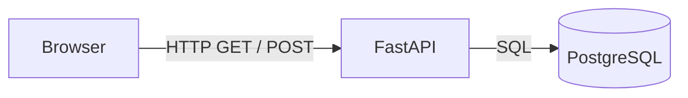
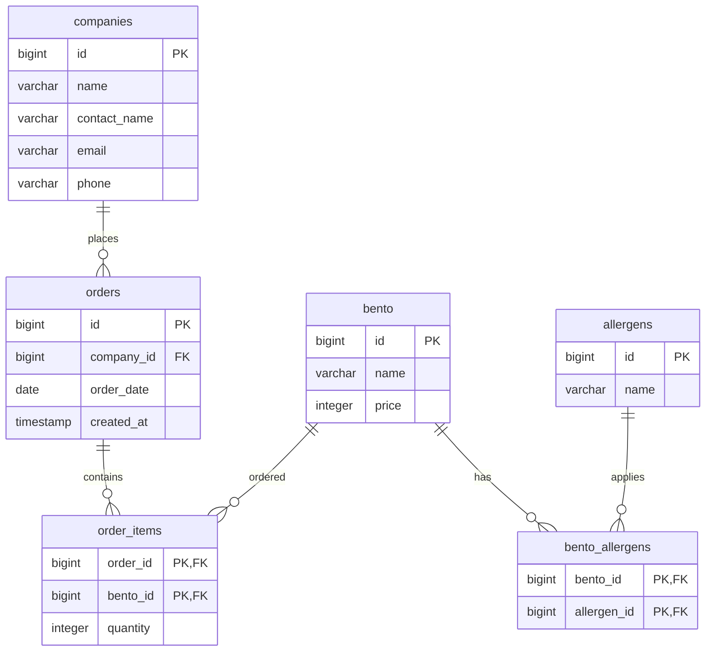
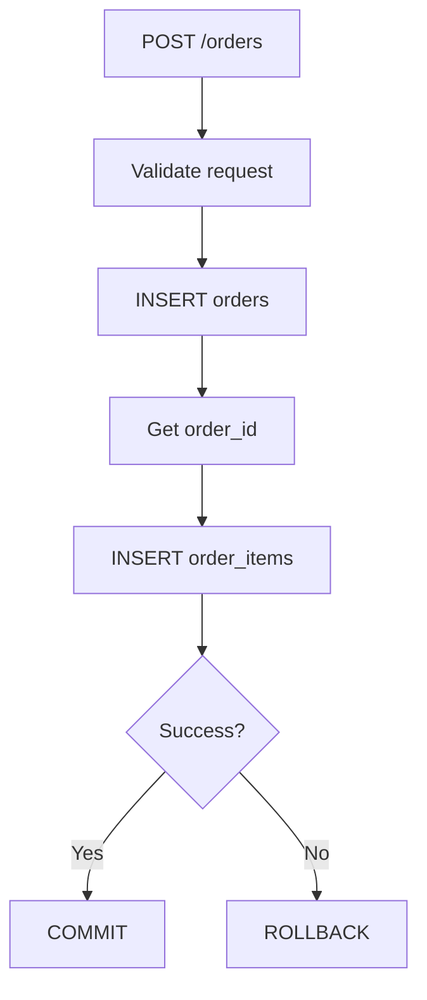
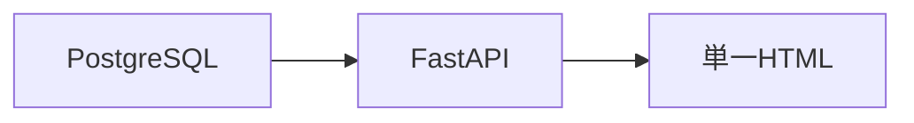
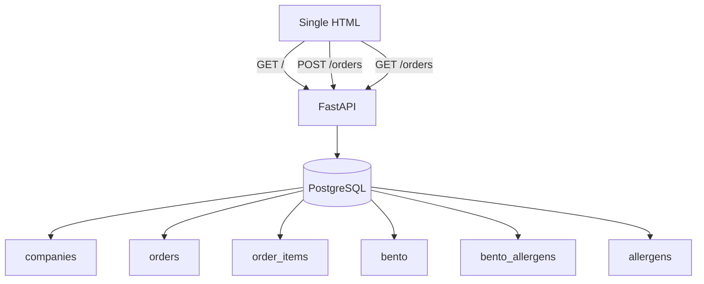

# FastAPI PostgreSQL Demo

弁当の仕出し注文を題材にした、業務用デモアプリです。

**FastAPI + PostgreSQL + HTML** というシンプルな構成で、RDBにおける1対多・多対多の関係と、Web APIからのデータ登録・取得を確認することを目的とします。

---

## 1. システム構成



使用技術：

* Python
* FastAPI
* Uvicorn
* psycopg
* PostgreSQL
* HTML / Jinja2

フロントエンドは、まずは**単一HTML**で構築します。

ReactやVueなどのフロントエンドフレームワークは使用しません。

---

## 2. PostgreSQL

使用するデータベース名：

```text
demo_db
```

接続確認：

```bash
psql demo_db
```

---

## 3. ディレクトリ構成

```text
fastapi-postgres-demo/
├── app/
│   ├── main.py
│   ├── db.py
│   └── templates/
│       └── index.html
├── .venv/
├── .gitignore
└── requirements.txt
```

---

## 4. データベーススキーマ

### companies

注文元の会社を管理します。

| Column       | Type         | Constraint | Description    |
| ------------ | ------------ | ---------- | -------------- |
| id           | BIGSERIAL    | PK         | 会社ID         |
| name         | VARCHAR(200) | NOT NULL   | 会社名         |
| contact_name | VARCHAR(100) |            | 担当者名       |
| email        | VARCHAR(255) |            | メールアドレス |
| phone        | VARCHAR(50)  |            | 電話番号       |

---

### orders

1回の注文を管理します。

| Column     | Type      | Constraint | Description |
| ---------- | --------- | ---------- | ----------- |
| id         | BIGSERIAL | PK         | 注文ID      |
| company_id | BIGINT    | FK         | 注文元会社  |
| order_date | DATE      | NOT NULL   | 注文日      |
| created_at | TIMESTAMP | NOT NULL   | 登録日時    |

関係：

```text
companies 1 ─── N orders
```

1つの会社から複数の注文が発生します。

---

### bento

弁当マスタです。

| Column | Type         | Constraint | Description |
| ------ | ------------ | ---------- | ----------- |
| id     | BIGSERIAL    | PK         | 弁当ID      |
| name   | VARCHAR(200) | NOT NULL   | 弁当名      |
| price  | INTEGER      | NOT NULL   | 価格        |

---

### order_items

1つの注文に含まれる弁当と数量を管理します。

| Column   | Type    | Constraint | Description |
| -------- | ------- | ---------- | ----------- |
| order_id | BIGINT  | PK, FK     | 注文ID      |
| bento_id | BIGINT  | PK, FK     | 弁当ID      |
| quantity | INTEGER | NOT NULL   | 数量        |

複合主キー：

```text
PRIMARY KEY (order_id, bento_id)
```

関係：

```text
orders N ─── N bento
       ↓
   order_items
```

例えば、

```text
注文ID 1
  ├── 唐揚げ弁当 × 10
  ├── 鮭弁当     × 5
  └── 幕の内弁当 × 3
```

のような注文を表現できます。

---

### allergens

アレルギー情報のマスタです。

| Column | Type         | Constraint       | Description  |
| ------ | ------------ | ---------------- | ------------ |
| id     | BIGSERIAL    | PK               | アレルギーID |
| name   | VARCHAR(100) | NOT NULL, UNIQUE | アレルギー名 |

---

### bento_allergens

弁当とアレルギーの多対多関係を管理します。

| Column      | Type   | Constraint | Description  |
| ----------- | ------ | ---------- | ------------ |
| bento_id    | BIGINT | PK, FK     | 弁当ID       |
| allergen_id | BIGINT | PK, FK     | アレルギーID |

関係：

```text
bento N ─── N allergens
          ↓
    bento_allergens
```

例えば、

```text
唐揚げ弁当
 ├── 小麦
 ├── 卵
 └── 大豆
```

のような情報を表現できます。

---

## 5. 全体のER構造



---

# 6. API

## GET `/`

注文登録画面を表示します。

### Request

```http
GET /
```

### Response

HTMLを返します。

HTMLには以下の情報を渡します。

```text
companies
bentos
```

### HTMLで利用するデータ

#### companies

```text
company[0] = id
company[1] = name
```

例：

```text
1, 株式会社ABC
2, 株式会社XYZ
```

#### bentos

```text
bento[0] = id
bento[1] = name
bento[2] = price
```

例：

```text
1, 唐揚げ弁当, 800
2, 鮭弁当, 850
3, 幕の内弁当, 1000
```

---

# 7. POST `/orders`

注文を登録します。

注文は、

* 注文元会社
* 注文日
* 複数の弁当
* 各弁当の数量

を含みます。

### Request

```http
POST /orders
Content-Type: application/x-www-form-urlencoded
```

フォームの主要な項目：

```text
company_id
order_date
quantity_1
quantity_2
quantity_3
...
```

`quantity_N` の `N` は `bento.id` を表します。

例えば、

```text
company_id=1
order_date=2026-08-29

quantity_1=10
quantity_2=5
quantity_3=3
```

は、

```text
株式会社ABC
2026-08-29

唐揚げ弁当 × 10
鮭弁当     × 5
幕の内弁当 × 3
```

を意味します。

---

## POST `/orders` の処理

注文登録では、以下の処理を**1つのトランザクション**として実行します。



重要な点：

```text
orders
```

だけ登録されて、

```text
order_items
```

が登録されない状態を作らないこと。

そのため、注文と注文内容は同じトランザクションで処理します。

---

# 8. 注文履歴

注文履歴を取得する場合は、以下のようなJOINを使用します。

```sql
SELECT
    o.id AS order_id,
    o.order_date,
    c.name AS company_name,
    b.name AS bento_name,
    oi.quantity,
    b.price,
    b.price * oi.quantity AS subtotal
FROM orders o
JOIN companies c
    ON c.id = o.company_id
JOIN order_items oi
    ON oi.order_id = o.id
JOIN bento b
    ON b.id = oi.bento_id
ORDER BY
    o.id,
    b.id;
```

取得結果：

| order_id | order_date | company_name | bento_name | quantity | price | subtotal |
| -------: | ---------- | ------------ | ---------- | -------: | ----: | -------: |
|        1 | 2026-08-29 | 株式会社ABC  | 唐揚げ弁当 |       10 |   800 |     8000 |
|        1 | 2026-08-29 | 株式会社ABC  | 鮭弁当     |        5 |   850 |     4250 |
|        1 | 2026-08-29 | 株式会社ABC  | 幕の内弁当 |        3 |  1000 |     3000 |

---

# 9. HTMLの設計キー

注文登録画面では、以下の項目を持たせます。

```text
会社
    company_id

注文日
    order_date

弁当
    bento.id
    bento.name
    bento.price

数量
    quantity_{bento.id}
```

HTML上では、例えば：

```html
<select name="company_id">
```

会社選択：

```html
<option value="1">株式会社ABC</option>
```

弁当数量：

```html
<input
    type="number"
    name="quantity_1"
    value="0"
    min="0"
>
```

という形式にします。

ここで、

```text
quantity_1
```

の `1` は、

```text
bento.id = 1
```

です。

したがって、FastAPI側では `quantity_` の後ろから弁当IDを取得できます。

---

# 10. 画面とDBの対応

| HTML       | FastAPI        | PostgreSQL             |
| ---------- | -------------- | ---------------------- |
| 会社選択   | `company_id`   | `companies.id`         |
| 注文日     | `order_date`   | `orders.order_date`    |
| 弁当       | `bento_id`     | `bento.id`             |
| 数量       | `quantity`     | `order_items.quantity` |
| 注文       | `POST /orders` | `orders`               |
| 注文明細   | `POST /orders` | `order_items`          |
| アレルギー | 今後実装       | `bento_allergens`      |

---

# 11. 起動

仮想環境を有効化：

```bash
source .venv/bin/activate
```

FastAPIを起動：

```bash
uvicorn app.main:app --reload
```

ブラウザ：

```text
http://127.0.0.1:8000/
```

Swagger UI：

```text
http://127.0.0.1:8000/docs
```

---

# 12. 開発の次のステップ

現在は、



という最小構成です。

今後は以下の順番で拡張します。

1. `POST /orders` の実装
2. 注文登録完了画面
3. `GET /orders` による注文履歴
4. 注文詳細画面
5. 弁当のアレルギー情報表示
6. HTML/CSSの改善
7. JavaScriptによる入力支援
8. FastAPIのRepository層への分離
9. テスト追加
10. Docker化

最終的には、



という構成を目指します。

---

## 13. 設計上の方針

このデモでは、まず**理解しやすさを優先**します。

* ORMは使用しない
* SQLを明示的に記述する
* PostgreSQLの外部キーを利用する
* 多対多は中間テーブルで表現する
* 注文登録はトランザクションで処理する
* フロントエンドは単一HTMLから始める
* 必要以上にフレームワークを導入しない

最終的な目的は、高機能なWebアプリを作ることではなく、

> **「業務上のデータをRDBでどのように表現し、それをFastAPIからどのように扱うか」を説明できる小さな実例を作ること**

です。
